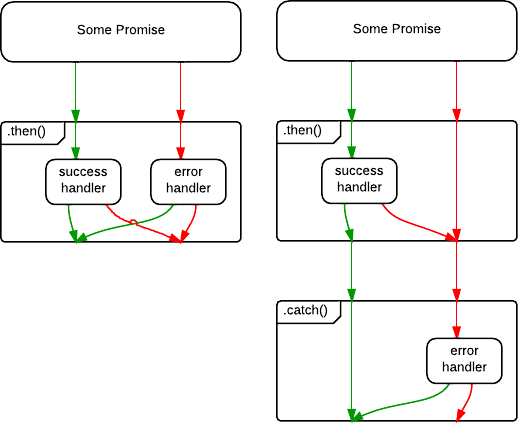

The `catch` method on a promise is pretty simple because this is an alias if `then(null, callback)`.

```javascript
var promise = request();

promise.catch(function(error) {
    displayError(error); 
});

// This is the same code as this:
promise.then(null, function(error) {
    displayError(error);
});
```

Why `catch` is so important ? Because combined with the chaining feature of the promises, it become very strong. But before we continue, you have to learn the differences between this 2 codes:

```javascript
// Code 1
var promise = request();

promise.then(function(data) {
    console.log(data);
}, function(error) {
    console.error(error);
});


// Code 2
var promise = request();

promise

.then(function(data) {
    console.log(data);
})

.catch(function(error) {
    console.error(data); 
});
```

In the first code, we call `then` with a success callback and an error callback. In the second code, we call `then` with a success callback and after that we call `catch` with an error callback. The difference is in the promise returned by the `then` function. In the second code, you are not calling `catch` on the original promise, you call `catch` on the promise returned by `then`. If a `then` has no error callback provided, it will not stop a rejected promise. So the promise will end in the `catch`. For a better understanding, take a look at this control flow diagrams (left diagram is for code 1, right diagram is for code 2).


Source: [Stackoverflow](https://stackoverflow.com/questions/24662289/when-is-thensuccess-fail-considered-an-antipattern-for-promises)

To understand how to use `then` and `catch` directly, you can think it as a pretty similar way of using `try { ... } catch { ... }`. Let's take the 2 codes and express them in a "pseudo synchronous code"

```javascript
// Code 1
try {
    var promise = request();    
} catch (error) {
    console.error(error);
}
console.log(data);

// Code 2
try {
    var promise = request();
    console.log(data);
} catch (error) {
    console.error(error);
}
```

The difference is easy to understand when you express the code in a "pseudo synchronous code". You can use the promises `catch` like a normal `catch`. And everything is simple to understand.